<div align="center">


# Sylithe Ocean Model

**Daily 3-D ocean temperature, surface to 1000 m, reconstructed from satellites alone — live, with uncertainty, for the North Indian Ocean.**

Smart India Hackathon 2026 · Problem Statement **26066** · Ministry of Earth Sciences / INCOIS


</div>

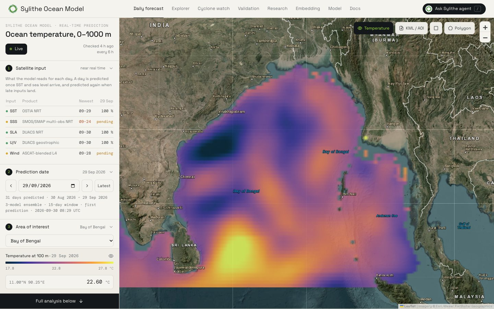

---

## At a glance

| | |
|---|---|
| **What** | Temperature at 15 standard depths (0, 5, 10, 20, 30, 50, 75, 100, 125, 150, 200, 300, 500, 700, 1000 m) on a 0.25° grid, every day, with a per-point 1σ uncertainty |
| **Where** | North Indian Ocean, 5–30°N × 45–105°E (101 × 241 cells) — Bay of Bengal and Arabian Sea |
| **From** | Five satellite products only: SST, SSS, sea level anomaly, surface currents, 10 m winds |
| **Accuracy (2023, never seen in training)** | **0.662 °C** RMSE vs GLORYS12 · **0.757 °C** vs 9,469 independent Argo measurements |
| **Beats** | The published Attention 3D U-Net++ (ESSD 2026) retrained on identical data, ridge regression, climatology and the HYCOM operational model |
| **Live** | Runs every 6 h on GitHub Actions: new satellite day → prediction within hours; re-predicted when late inputs arrive |
| **Applications** | Cyclone heat potential, Ocean Cyclone Potential Index, disturbance watch, GDACS cyclone alerts, LLM-worded bulletins |

> 📄 **Research paper:** [Sylithe Ocean Model — full paper (PDF)](docs/paper/Sylithe_Ocean_Model_paper.pdf) · Karan Singh, Sneha Pal, Ankush Singh, Mehwish Siddiquie, Nitin Singh, Sudhirkumar Yadav (TCET Mumbai)

## Contents

1. [The problem](#1-the-problem)
2. [Results and benchmarks](#2-results-and-benchmarks)
3. [How it works](#3-how-it-works)
4. [The model](#4-the-model)
5. [Live system](#5-live-system)
6. [Cyclone watch](#6-cyclone-watch)
7. [Web console and user workflow](#7-web-console-and-user-workflow)
8. [Tech stack](#8-tech-stack)
9. [Repository layout](#9-repository-layout)
10. [Quick start](#10-quick-start)
11. [Data formats and live endpoints](#11-data-formats-and-live-endpoints)
12. [Limitations and roadmap](#12-limitations-and-roadmap)
13. [References](#13-references)

---

## 1. The problem

Satellites see the ocean **surface** every day, everywhere. The ocean **interior** — the thermocline, the warm layer that
feeds cyclones, the mixed layer that sets monsoon air–sea exchange — is measured only by a few thousand scattered Argo floats.
PS 26066 asks for the missing piece: a daily, gridded, subsurface temperature field for the North Indian Ocean, built from
surface satellite data, trained against the GLORYS12 reanalysis and verified against independent Argo profiles.

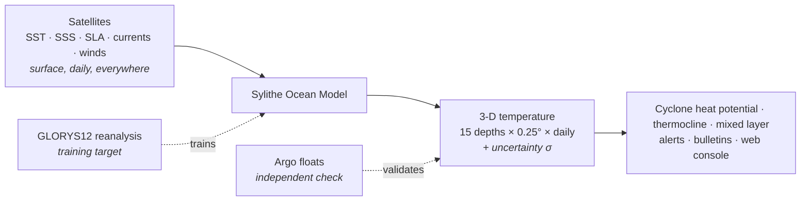
```mermaid
flowchart LR
    S["Satellites<br/>SST · SSS · SLA · currents · winds<br/><i>surface, daily, everywhere</i>"] --> M["Sylithe Ocean Model"]
    M --> V["3-D temperature<br/>15 depths × 0.25° × daily<br/><i>+ uncertainty σ</i>"]
    G["GLORYS12 reanalysis<br/><i>training target</i>"] -. trains .-> M
    A["Argo floats<br/><i>independent check</i>"] -. validates .-> V
    V --> U["Cyclone heat potential · thermocline · mixed layer<br/>alerts · bulletins · web console"]
```

## 2. Results and benchmarks

All methods were scored on **2023**, a year no model saw during training, on the same grid, depths and the same
**9,469 Argo measurements from 663 profiles**. Lower RMSE is better.

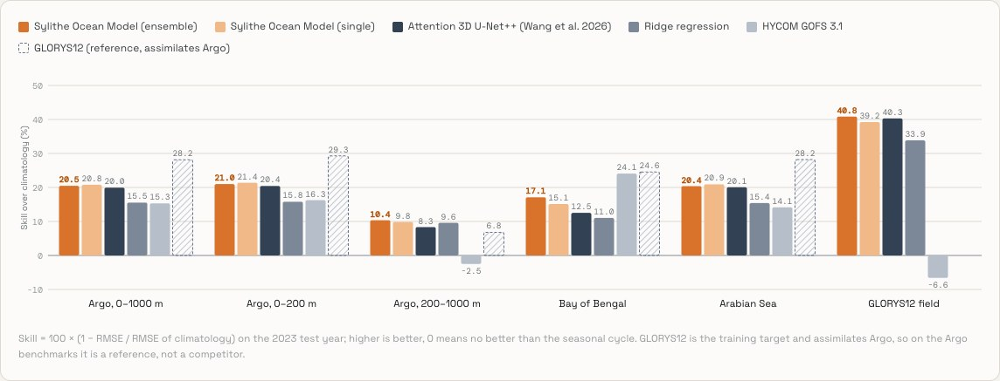

<sub>Skill = 100 × (1 − RMSE / RMSE of climatology). Higher is better. GLORYS12 is the training target and assimilates Argo, so it is a reference, not a competitor.</sub>

### Leaderboard (RMSE, °C)

| # | Method | Type | vs GLORYS12 | vs Argo | Argo 0–200 m | Argo 200–1000 m | Bay of Bengal | Arabian Sea |
|---|---|---|---:|---:|---:|---:|---:|---:|
| — | GLORYS12 reanalysis | reference (assimilates Argo) | — | 0.684 | 0.761 | 0.369 | 0.758 | 0.680 |
| ★ | **Sylithe Ocean Model — 3-model ensemble** | **ours** | **0.662** | **0.757** | **0.850** | **0.355** | **0.833** | **0.754** |
| ★ | **Sylithe Ocean Model — single model** | **ours** | 0.680 | **0.754** | **0.846** | 0.357 | 0.853 | **0.749** |
| 3 | Attention 3D U-Net++ (Wang et al., ESSD 2026), retrained here | published method | 0.668 | 0.762 | 0.856 | 0.363 | 0.879 | 0.757 |
| 4 | Ridge regression (per depth, local features) | baseline | 0.740 | 0.804 | 0.906 | 0.358 | 0.894 | 0.801 |
| 5 | HYCOM GOFS 3.1 (independent operational model) | reference | 1.193 | 0.806 | 0.901 | 0.406 | 0.763 | 0.813 |
| 6 | Climatology (GLORYS day-of-year mean) | baseline | 1.119 | 0.952 | 1.076 | 0.396 | 1.005 | 0.947 |

### Where Sylithe wins — and how sure we are

Paired bootstrap over Argo profiles (2,000 resamples; all depths of a profile resampled together). *p* = probability that Sylithe is **not** better.

| Comparison (ensemble vs …) | Region · depths | RMSE ours → theirs (°C) | 95 % CI of the gain | *p* | Verdict |
|---|---|---|---|---:|---|
| Attention 3D U-Net++ | North Indian Ocean · **200–1000 m** | 0.355 → 0.363 | +0.003 … +0.014 | **0.003** | ✅ significantly better |
| Attention 3D U-Net++ | **Bay of Bengal** · 0–1000 m | 0.833 → 0.879 | +0.012 … +0.078 | **0.007** | ✅ significantly better |
| Attention 3D U-Net++ | Bay of Bengal · 0–200 m | 0.957 → 1.011 | +0.014 … +0.091 | **0.007** | ✅ significantly better |
| Attention 3D U-Net++ | Arabian Sea · 200–1000 m | 0.351 → 0.361 | +0.004 … +0.017 | **< 0.001** | ✅ significantly better |
| Attention 3D U-Net++ | North Indian Ocean · 0–1000 m | 0.757 → 0.762 | −0.003 … +0.015 | 0.117 | ➖ better, not significant |
| HYCOM GOFS 3.1 | North Indian Ocean · 0–1000 m | 0.757 → 0.806 | +0.016 … +0.083 | **0.002** | ✅ significantly better |
| Ridge regression | North Indian Ocean · 0–1000 m | 0.757 → 0.804 | +0.029 … +0.065 | **< 0.001** | ✅ significantly better |
| Climatology | North Indian Ocean · 0–1000 m | 0.757 → 0.952 | +0.167 … +0.224 | **< 0.001** | ✅ significantly better |

**In short:** Sylithe beats every method except GLORYS12 itself (which ingests the very Argo floats used for scoring). Against the
published state-of-the-art architecture, the advantage is statistically significant in the deep ocean and in the Bay of Bengal.

### Evaluation figures

<table>
<tr>
<td width="50%">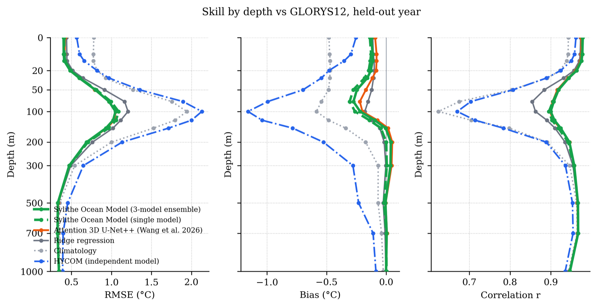<br/><sub><b>Skill by depth vs GLORYS12.</b> RMSE, bias, correlation 0–1000 m; errors peak in the thermocline (75–150 m).</sub></td>
<td width="50%">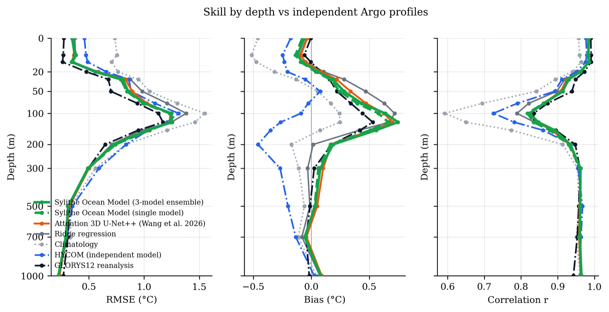<br/><sub><b>Skill by depth vs Argo.</b> Below 200 m Sylithe matches or beats GLORYS12.</sub></td>
</tr>
<tr>
<td>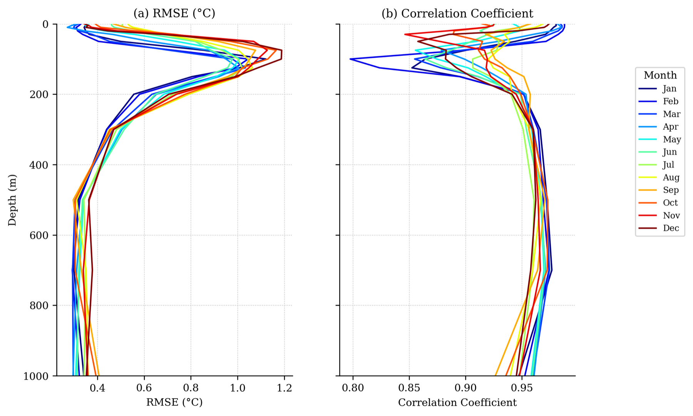<br/><sub><b>RMSE and correlation by depth and month</b> (layout of Wang et al. 2026, Fig. 7).</sub></td>
<td>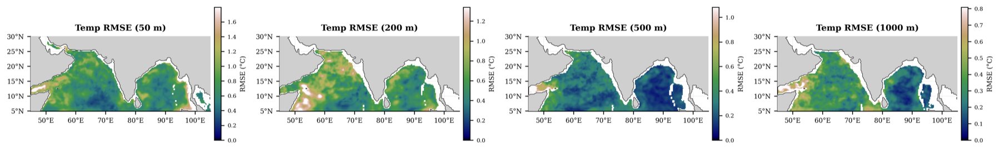<br/><sub><b>RMSE maps</b> at standard depths, 2023.</sub></td>
</tr>
<tr>
<td>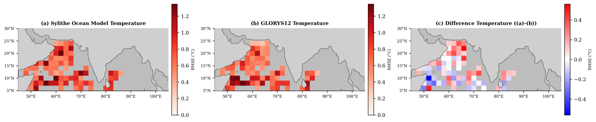<br/><sub><b>Error on a 2° grid vs Argo</b>: Sylithe, GLORYS12 and their difference.</sub></td>
<td>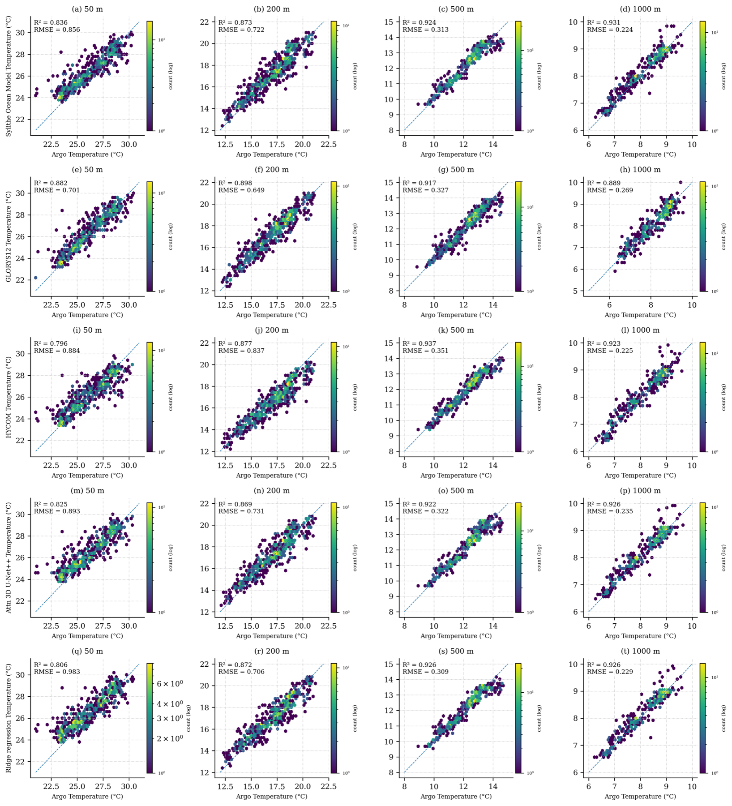<br/><sub><b>Predicted vs observed</b>, every Argo measurement in 2023.</sub></td>
</tr>
<tr>
<td>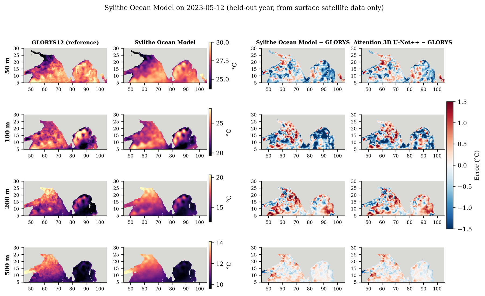<br/><sub><b>Reconstruction vs GLORYS12</b>, 12 May 2023 (Cyclone Mocha).</sub></td>
<td>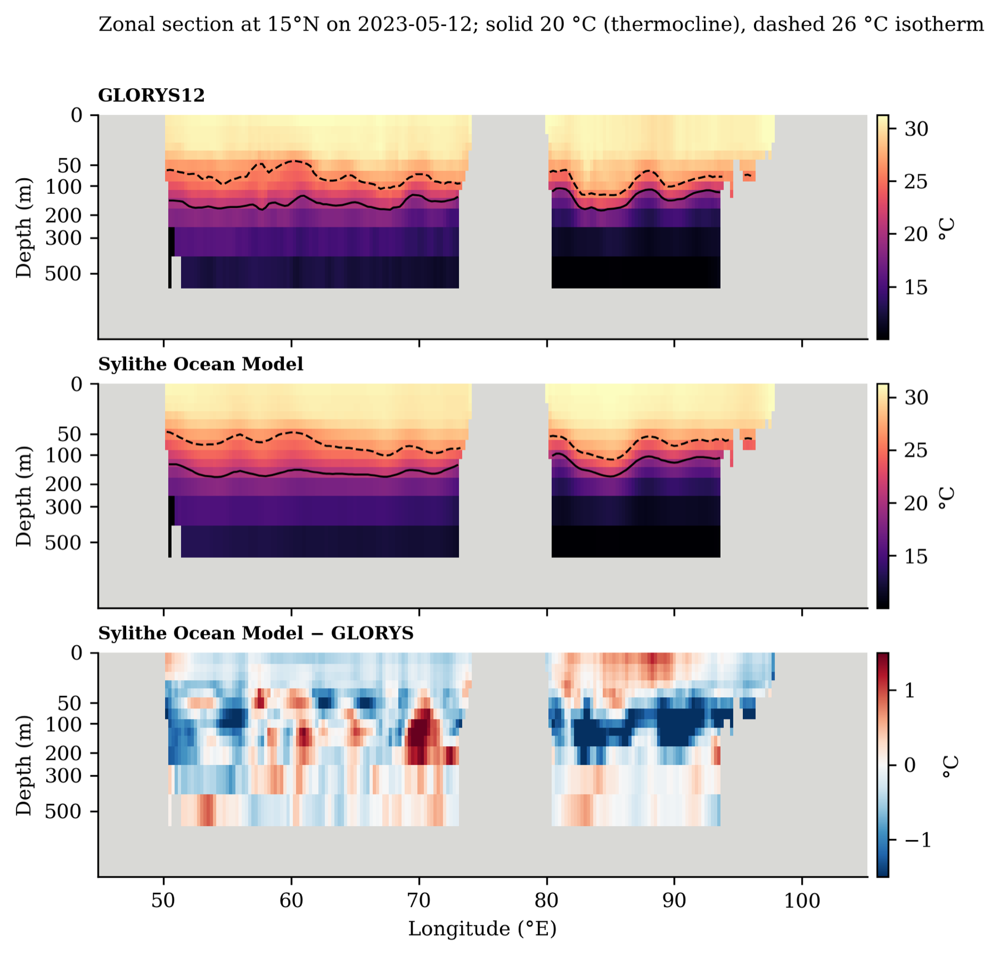<br/><sub><b>Vertical section</b> through the Bay of Bengal.</sub></td>
</tr>
<tr>
<td>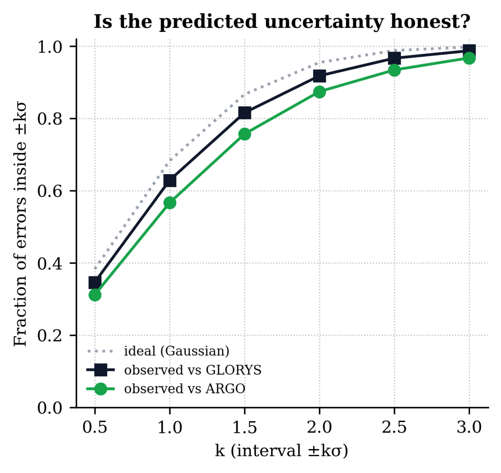<br/><sub><b>Uncertainty calibration</b>: 57 % of Argo errors inside ±1σ (68 % ideal).</sub></td>
<td>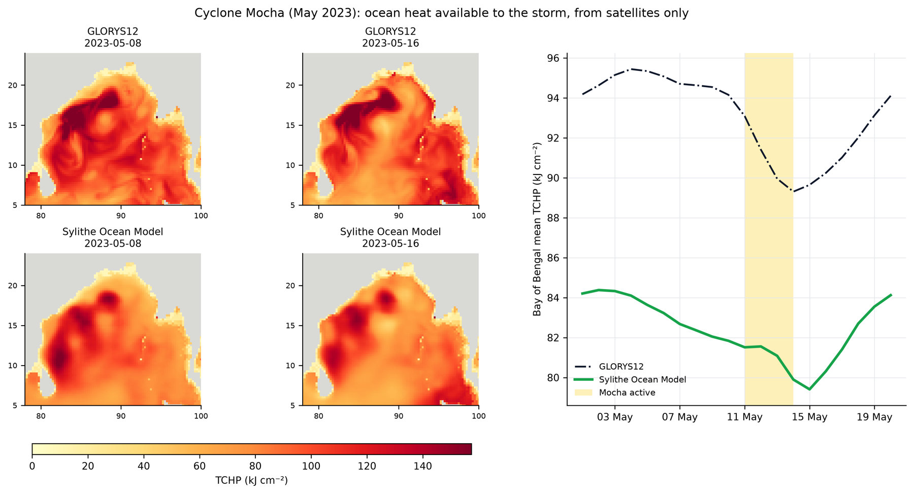<br/><sub><b>Cyclone heat potential during Mocha</b> (May 2023).</sub></td>
</tr>
</table>

More: [`web/public/figures/`](web/public/figures) (20 figures) and the **Research** page of the console.

## 3. How it works

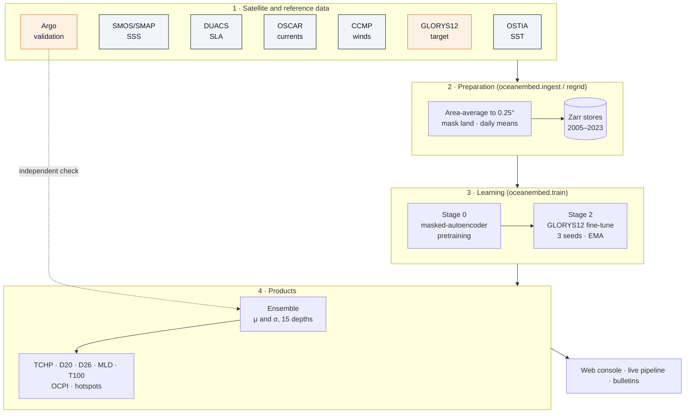
```mermaid
flowchart TB
    subgraph SRC["1 · Satellite and reference data"]
        direction LR
        OSTIA["OSTIA<br/>SST"]:::d
        SSS["SMOS/SMAP<br/>SSS"]:::d
        DUACS["DUACS<br/>SLA"]:::d
        OSCAR["OSCAR<br/>currents"]:::d
        CCMP["CCMP<br/>winds"]:::d
        GLORYS["GLORYS12<br/>target"]:::t
        ARGO["Argo<br/>validation"]:::t
    end
    subgraph PREP["2 · Preparation (oceanembed.ingest / regrid)"]
        R["Area-average to 0.25°<br/>mask land · daily means"] --> Z[("Zarr stores<br/>2005–2023")]
    end
    subgraph LEARN["3 · Learning (oceanembed.train)"]
        SSL["Stage 0<br/>masked-autoencoder<br/>pretraining"] --> FT["Stage 2<br/>GLORYS12 fine-tune<br/>3 seeds · EMA"]
    end
    subgraph OUT["4 · Products"]
        E["Ensemble<br/>μ and σ, 15 depths"] --> D["TCHP · D20 · D26 · MLD · T100<br/>OCPI · hotspots"]
    end
    SRC --> PREP --> LEARN --> OUT
    ARGO -. independent check .-> E
    OUT --> WEB["Web console · live pipeline · bulletins"]
    classDef d fill:#F1F5F9,stroke:#0F172A,color:#0F172A
    classDef t fill:#FDF1E4,stroke:#D9722B,color:#0F172A
```

**Data split.** Train 2005–2021 · validate 2022 (epoch selection) · test 2023 (reported). 2005 is the start of the dense-Argo
era, when GLORYS12 is best constrained.

## 4. The model

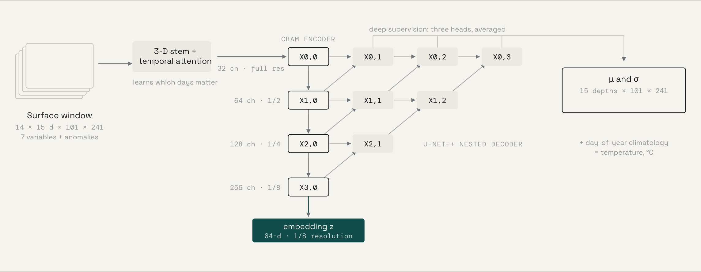

| Block | What it does |
|---|---|
| **Input** | 15-day window of 7 variables, each as value **and** day-of-year anomaly (14 channels) + 0/1 missing flags + 5 static channels (ocean mask, lat, lon, sin/cos day of year) |
| **3-D stem + temporal attention** | 3-D convolutions mix variables and neighbouring days; a learned softmax weights each of the 15 days per cell |
| **CBAM encoder** | Residual conv blocks with channel + spatial attention, 32 → 64 → 128 → 256 channels, down to 1/8 resolution |
| **Embedding z** | 64-d latent ocean state at 1/8 resolution — pretrained self-supervised, visualised on the Embedding page |
| **U-Net++ nested decoder** | Dense skip paths X<sub>i,j</sub>; deep supervision averages three heads |
| **Output** | 15 means + 15 log-variances → temperature (added to the GLORYS12 day-of-year climatology) and σ |

**Training recipe.** β-NLL loss (β = 0.5) · vertical-gradient loss (keeps the thermocline sharp) · surface-consistency loss ·
AdamW, lr 2×10⁻⁴, weight decay 0.05 · random 64 × 128 crops · EMA 0.999 · variable dropout 0.3 (trains the SST + SLA-only mode) ·
early stopping · **3 seeds (42, 7, 1234)** ≈ 2.4 M parameters each.

**Uncertainty.** σ² = mean member variance + variance of member means (what the surface cannot tell + where the models disagree).

**Why it beats the published architecture** — same data, same grid, same year:
- predicts **anomalies from climatology**, so capacity goes to eddies, Kelvin/Rossby waves and cold wakes, not the seasonal cycle;
- **self-supervised pretraining** of the encoder on 19 years of surface data before any subsurface label;
- **β-NLL + vertical-gradient loss** — learns its own uncertainty and keeps the thermocline sharp;
- **seed ensemble + EMA** — smoother, better-calibrated fields;
- **variable dropout** — keeps working when salinity or winds arrive late in real time.

## 5. Live system

Every six hours a GitHub Actions job checks the Copernicus catalogue, ingests only new days and predicts them. When late
inputs arrive (salinity ~6 days, winds ~1 day), recent days are **predicted again** and their revision number goes up.

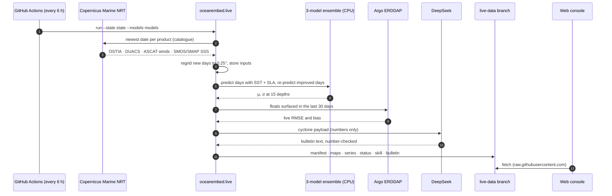
```mermaid
sequenceDiagram
    autonumber
    participant Cron as GitHub Actions (every 6 h)
    participant CM as Copernicus Marine NRT
    participant Live as oceanembed.live
    participant Model as 3-model ensemble (CPU)
    participant Argo as Argo ERDDAP
    participant LLM as DeepSeek
    participant Branch as live-data branch
    participant Web as Web console
    Cron->>Live: run --state state --models models
    Live->>CM: newest date per product (catalogue)
    CM-->>Live: OSTIA · DUACS · ASCAT winds · SMOS/SMAP SSS
    Live->>Live: regrid new days to 0.25°, store inputs
    Live->>Model: predict days with SST + SLA, re-predict improved days
    Model-->>Live: μ, σ at 15 depths
    Live->>Argo: floats surfaced in the last 30 days
    Argo-->>Live: live RMSE and bias
    Live->>LLM: cyclone payload (numbers only)
    LLM-->>Live: bulletin text, number-checked
    Live->>Branch: manifest · maps · series · status · skill · bulletin
    Web->>Branch: fetch (raw.githubusercontent.com)
```

| Input | Near-real-time product | Typical delay |
|---|---|---|
| SST | OSTIA NRT | ~1 day |
| Sea level anomaly | DUACS NRT all-satellite L4 | same day |
| Currents | geostrophic currents from DUACS NRT | same day |
| Winds | ASCAT-blended L4 | ~1 day |
| SSS | SMOS/SMAP multi-observation NRT | ~6 days |

Live accuracy is tracked separately against Argo (first month: ≈ 1.05 °C, higher than 2023 because near-real-time substitutes
replace the reprocessed OSCAR currents and CCMP winds used in training). Setup: [`docs/LIVE.md`](docs/LIVE.md).

## 6. Cyclone watch

The Cyclone page turns inputs and prediction into a **transparent, rule-based** measure of how strongly the ocean can support
a tropical cyclone, then hands the numbers — and only the numbers — to an LLM to word a bulletin.

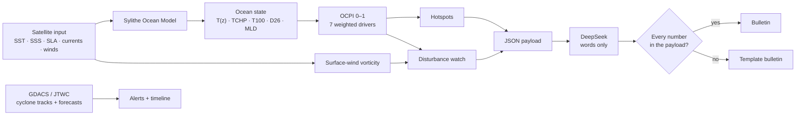
```mermaid
flowchart LR
    I["Satellite input<br/>SST · SSS · SLA · currents · winds"] --> M["Sylithe Ocean Model"]
    M --> S["Ocean state<br/>T(z) · TCHP · T100 · D26 · MLD"]
    I --> V["Surface-wind vorticity"]
    S --> O["OCPI 0–1<br/>7 weighted drivers"]
    O --> H["Hotspots"]
    O --> W["Disturbance watch"]
    V --> W
    G["GDACS / JTWC<br/>cyclone tracks + forecasts"] --> A["Alerts + timeline"]
    H --> P["JSON payload"]
    W --> P
    P --> L["DeepSeek<br/>words only"]
    L --> C{"Every number<br/>in the payload?"}
    C -- yes --> B["Bulletin"]
    C -- no --> T["Template bulletin"]
```

**Ocean Cyclone Potential Index (OCPI)** — each driver scored 0–1 between published limits, weighted; 0 where SST < 26 °C:

| Driver | 0 at | 1 at | Weight | Basis |
|---|---|---|---:|---|
| Upper-100 m mean temperature | 25 °C | 29.5 °C | 0.25 | Price (2009) |
| Tropical cyclone heat potential | 0 | 120 kJ cm⁻² | 0.25 | Leipper & Volgenau (1972); Mainelli et al. (2008) |
| Sea surface temperature | 26 °C | 30.5 °C | 0.15 | Gray (1968) |
| Depth of the 26 °C isotherm | 30 m | 120 m | 0.10 | Shay et al. (2000) |
| Mixed-layer depth | 10 m | 60 m | 0.10 | Lin et al. (2013) |
| Sea level anomaly | −0.1 m | +0.2 m | 0.10 | Lin et al. (2005) |
| Sea surface salinity (barrier layer) | 35 psu | 31 psu | 0.05 | Balaguru et al. (2012) |

<table>
<tr>
<td width="50%">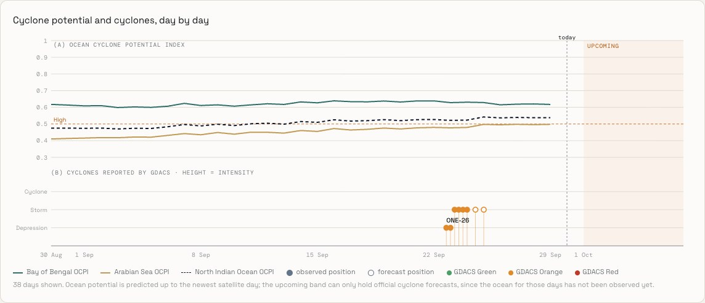<br/><sub><b>Timeline:</b> OCPI per basin with GDACS cyclones as lollipops (solid = observed, hollow = forecast) and an upcoming band.</sub></td>
<td width="50%">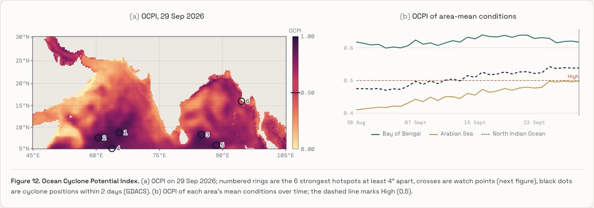<br/><sub><b>OCPI map</b> with hotspots, watch points and cyclone positions.</sub></td>
</tr>
<tr>
<td colspan="2">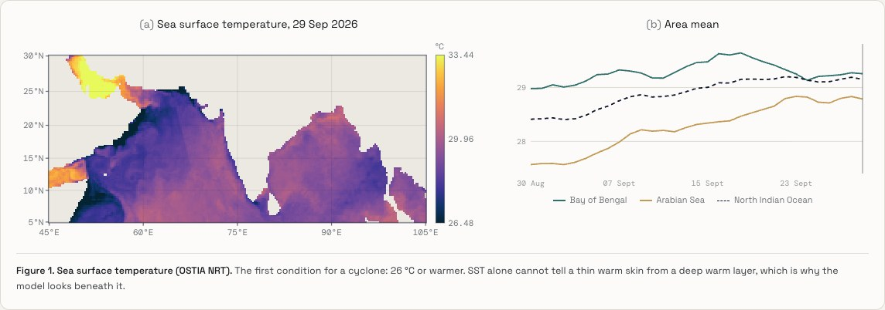<br/><sub>Every input and every output gets the same two-panel figure: (a) the field on the day, (b) area means for the Bay of Bengal, Arabian Sea and North Indian Ocean.</sub></td>
</tr>
</table>

> The index describes **ocean** support for cyclones. It is not a genesis, track or landfall forecast — wind shear and humidity
> are not in the data. Official warnings: IMD. Details: [`docs/CYCLONE_AND_ROADMAP.md`](docs/CYCLONE_AND_ROADMAP.md).

## 7. Web console and user workflow

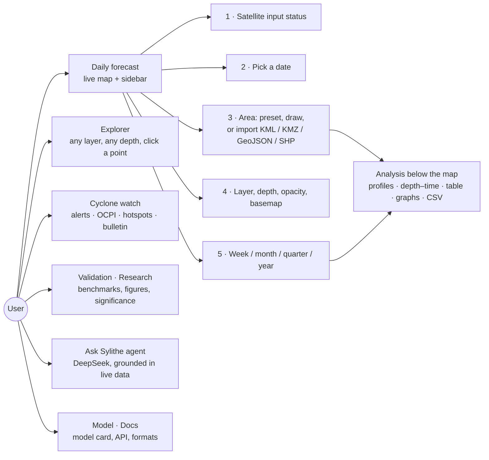
```mermaid
flowchart LR
    U(("User")) --> D["Daily forecast<br/>live map + sidebar"]
    D --> D1["1 · Satellite input status"]
    D --> D2["2 · Pick a date"]
    D --> D3["3 · Area: preset, draw,<br/>or import KML / KMZ / GeoJSON / SHP"]
    D --> D4["4 · Layer, depth, opacity, basemap"]
    D --> D5["5 · Week / month / quarter / year"]
    D3 --> AN["Analysis below the map<br/>profiles · depth–time · table · graphs · CSV"]
    D5 --> AN
    U --> X["Explorer<br/>any layer, any depth, click a point"]
    U --> C["Cyclone watch<br/>alerts · OCPI · hotspots · bulletin"]
    U --> Q["Validation · Research<br/>benchmarks, figures, significance"]
    U --> AG["Ask Sylithe agent<br/>DeepSeek, grounded in live data"]
    U --> DOC["Model · Docs<br/>model card, API, formats"]
```

<table>
<tr>
<td width="50%"><br/><sub><b>Daily forecast</b> — full-height map, numbered sidebar, live cursor readout, AOI tools.</sub></td>
<td width="50%">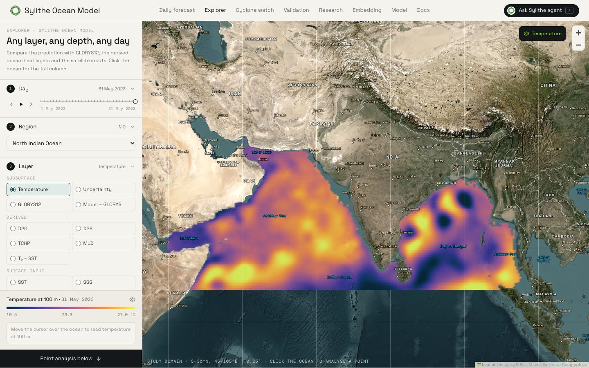<br/><sub><b>Explorer</b> — prediction, GLORYS12, model − GLORYS, derived layers and inputs at any depth.</sub></td>
</tr>
</table>

| Page | For |
|---|---|
| **Daily forecast** | The live prediction for any day and area: map layers, KML/KMZ/GeoJSON/Shapefile import, rectangle/polygon drawing, point probe, profiles, depth–time sections, week–year graphs, input status, run log |
| **Explorer** | Every layer at every depth; click the ocean for profile, section and history with CSV |
| **Cyclone watch** | GDACS alerts, cyclone timeline, OCPI, disturbance watch, hotspots and drivers, LLM bulletin |
| **Validation** | Skill by depth, every Argo float, error distribution, uncertainty honesty, benchmark chart and leaderboard |
| **Research** | All evaluation figures, significance tests, published context |
| **Embedding** | The 64-d latent state the encoder learned and the ocean regimes it separates |
| **Model** | Model card, architecture, hyperparameters, methods compared, uncertainty, limitations |
| **Docs** | Quickstart, concepts, CLI, Python API, data formats, live endpoints |

**Ask Sylithe agent** (header button or <kbd>/</kbd>) answers questions about the model, its results and today's ocean using
DeepSeek on the server, grounded in the model facts plus the live status, Argo check, leaderboard and cyclone numbers. Map
commands (“temperature at 150 m”, “probe 88E 15N”) act on the console directly.

## 8. Tech stack

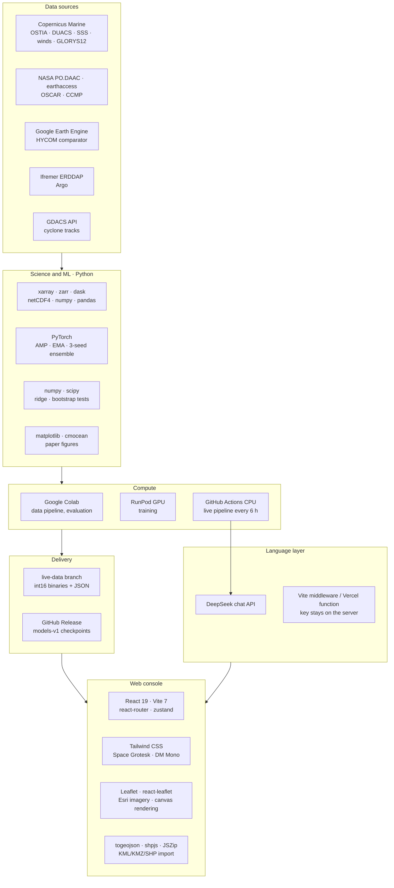
```mermaid
flowchart TB
    subgraph DATA["Data sources"]
        direction LR
        CMEMS["Copernicus Marine<br/>OSTIA · DUACS · SSS · winds · GLORYS12"]
        PODAAC["NASA PO.DAAC · earthaccess<br/>OSCAR · CCMP"]
        GEE["Google Earth Engine<br/>HYCOM comparator"]
        ERD["Ifremer ERDDAP<br/>Argo"]
        GDACS["GDACS API<br/>cyclone tracks"]
    end
    subgraph ML["Science and ML · Python"]
        direction LR
        XR["xarray · zarr · dask<br/>netCDF4 · numpy · pandas"]
        TORCH["PyTorch<br/>AMP · EMA · 3-seed ensemble"]
        SK["numpy · scipy<br/>ridge · bootstrap tests"]
        MPL["matplotlib · cmocean<br/>paper figures"]
    end
    subgraph COMPUTE["Compute"]
        direction LR
        COLAB["Google Colab<br/>data pipeline, evaluation"]
        RUNPOD["RunPod GPU<br/>training"]
        GHA["GitHub Actions CPU<br/>live pipeline every 6 h"]
    end
    subgraph DELIVERY["Delivery"]
        direction LR
        BR["live-data branch<br/>int16 binaries + JSON"]
        REL["GitHub Release<br/>models-v1 checkpoints"]
    end
    subgraph WEBAPP["Web console"]
        direction LR
        REACT["React 19 · Vite 7<br/>react-router · zustand"]
        UI["Tailwind CSS<br/>Space Grotesk · DM Mono"]
        MAP["Leaflet · react-leaflet<br/>Esri imagery · canvas rendering"]
        GEO["togeojson · shpjs · JSZip<br/>KML/KMZ/SHP import"]
    end
    subgraph AI["Language layer"]
        direction LR
        DS["DeepSeek chat API"]
        SRV["Vite middleware / Vercel function<br/>key stays on the server"]
    end
    DATA --> ML
    ML --> COMPUTE
    COMPUTE --> DELIVERY
    DELIVERY --> WEBAPP
    AI --> WEBAPP
    GHA --> DS
```

| Layer | Technology | Why |
|---|---|---|
| Data access | `copernicusmarine`, `earthaccess`, Earth Engine, ERDDAP, GDACS | Official sources named in the problem statement; all free |
| Storage | Zarr (int16 target, one day per chunk), NetCDF (CF) | Fast random access to 19 years × 15 depths on Colab/RunPod |
| Modelling | PyTorch, mixed precision | 3-D stem + CBAM encoder + U-Net++ decoder, β-NLL |
| Evaluation | numpy / scipy, paired bootstrap | Significance over Argo profiles, not just averages |
| Training compute | Google Colab, RunPod GPU | Colab for data and evaluation; a rented GPU for the three seeds |
| Operations | GitHub Actions (cron), GitHub Releases, `live-data` branch | Zero-cost, serverless, auditable history of every run |
| Front end | React 19, Vite 7, Tailwind 3, Leaflet | Fast static site; data rendered client-side from int16 grids |
| GIS in the browser | `@tmcw/togeojson`, `shpjs`, `jszip` | KML / KMZ / GeoJSON / Shapefile areas of interest |
| Language layer | DeepSeek (`deepseek-chat`) behind a server endpoint | Words bulletins and answers questions; never computes numbers |
| Hosting | Vercel (static site + `/api/agent` function) | One deploy for the console and the agent |

## 9. Repository layout

```text
.
├── oceanembed/                 Python package
│   ├── config.py               grid, depths, periods, data sources, training settings (single source of truth)
│   ├── ingest.py · regrid.py   download and regrid every product onto the 0.25° grid (Zarr)
│   ├── dataset.py              15-day windows, anomalies, normalisation, random crops
│   ├── model.py                OceanEmbedNet (Sylithe Ocean Model), SurfaceMAE, AttnUNetPP3D (published baseline)
│   ├── losses.py · train.py    β-NLL, vertical-gradient and surface losses; training with EMA and early stopping
│   ├── infer.py                ensemble reconstruction → NetCDF (μ, σ)
│   ├── baselines.py · benchmark.py · paper_eval.py   ridge, climatology, leaderboard, significance
│   ├── argo.py · metrics.py    Argo matching; TCHP, D20, D26, MLD
│   ├── figures.py · figures_paper.py   all evaluation figures
│   ├── daily.py                day-by-day replay with a prediction cache
│   ├── live.py                 near-real-time pipeline (ingest → predict → revise → Argo check → export)
│   ├── bulletin.py             cyclone payload + DeepSeek bulletin with number check
│   └── webexport.py            console export format v2
├── colab/                      notebooks 01–04 (generated by _build_notebooks.py)
├── scripts/                    RunPod setup, training and watch scripts
├── .github/workflows/live.yml  the live job (every 6 h)
├── docs/                       LIVE.md, CYCLONE_AND_ROADMAP.md, README images
└── web/                        React console
    ├── src/pages/              Daily, Explorer, Cyclone, Validation, Research, Embedding, Model, Docs
    ├── src/components/         map, charts (FigMap, BenchmarkBars, CycloneTimeline, DepthTimeChart …), workspace
    ├── src/lib/                data loader, ocean physics, AOI tools, cyclone logic, GDACS reader
    ├── server/agent.js         Sylithe agent (DeepSeek), shared by dev server and Vercel
    ├── api/agent.js            Vercel function
    └── public/                 figures, 2023 replay data, logo
```

## 10. Quick start

### Web console

```bash
cd web
npm install
npm run dev          # http://localhost:5173 — live data is read from the live-data branch
```

To enable the **Ask Sylithe agent** locally, create `web/.env.local` (git-ignored) with `DEEPSEEK_API_KEY=…`.
On Vercel, add the same variable in the project settings.

### Live pipeline (any machine, or GitHub Actions)

```bash
pip install torch --index-url https://download.pytorch.org/whl/cpu
pip install -r requirements-live.txt
python -m oceanembed.live sources                                  # newest date per feed (no login)
export COPERNICUSMARINE_SERVICE_USERNAME=… COPERNICUSMARINE_SERVICE_PASSWORD=…
python -m oceanembed.live run --state live_state --models MODELS  # seed*/glorys_best.pt + stats_v2.npz
```

On GitHub: repository secrets `CMEMS_USER`, `CMEMS_PASS` (and optionally `DEEPSEEK_API_KEY`), plus a release `models-v1` with the
checkpoints — see [`docs/LIVE.md`](docs/LIVE.md).

### Data and training

| Step | Where | Command / notebook |
|---|---|---|
| 1 · Download and regrid 2005–2023 | Colab | [01 · Data pipeline](https://colab.research.google.com/github/karan27-dev/Sylithe_Ocean_Embedding/blob/main/colab/01_data_pipeline.ipynb) |
| 2 · Train (SSL + 3 seeds + baselines) | GPU (RunPod / Colab) | `python -m oceanembed.run all --data DATA --root OUT --hours 6 --seeds 42 7 1234` |
| 3 · Evaluate and draw figures | Colab | `python -m oceanembed.paper_eval --data DATA --root OUT --out OUT/paper --figures` |
| 4 · Replay a year day by day | any | `python -m oceanembed.daily run --data DATA --root OUT` then `daily export --out web/public/data/ops` |

Credentials go in Colab secrets or GitHub secrets — never in code or notebooks.

## 11. Data formats and live endpoints

Live base URL: `https://raw.githubusercontent.com/karan27-dev/Sylithe_Ocean_Embedding/live-data/web`

| File | Contents |
|---|---|
| `manifest.json` | grid, depths, layer scales, list of mapped days |
| `days/{date}/{layer}.bin` | little-endian int16, `levels × 101 × 241`, rows north → south; `value = raw × scale + offset`, `-32768` = land |
| `series.json` | area means per day for NIO / BoB / AS: T and σ at 15 depths, inputs, TCHP, D20, D26, MLD |
| `index.json` | provenance of every day: computed at, ensemble size, window, revision, input coverage |
| `status.json` · `skill.json` | feed status of the last run · live Argo check |
| `bulletin.json` | cyclone payload, template bulletin and DeepSeek bulletin (when enabled) |

```python
import numpy as np, requests
BASE = "https://raw.githubusercontent.com/karan27-dev/Sylithe_Ocean_Embedding/live-data/web"
m = requests.get(f"{BASE}/manifest.json").json(); d = m["days"][-1]["date"]; s = m["layers"]["temp"]
q = np.frombuffer(requests.get(f"{BASE}/days/{d}/temp.bin").content, "<i2")
T = np.where(q == m["nodata"], np.nan, q * s["scale"] + s["offset"]).reshape(15, 101, 241)
```

Full reference: the **Docs** page of the console.

## 12. Limitations and roadmap

**Honest limitations**
- Over the whole column, the lead over the published architecture is small (not significant); it is significant below 200 m and in the Bay of Bengal.
- The model inherits part of the GLORYS12 bias (≈ +0.2 °C against Argo) and is smoother than the reanalysis at the smallest eddy scales.
- σ is about 20 % too small.
- Live inputs are near-real-time substitutes; live RMSE is higher than on reprocessed 2023.
- The cyclone index is ocean-only: no shear, humidity or track forecast.

**Next**
1. Fine-tune on the near-real-time archive to close the live accuracy gap.
2. Calibrate OCPI weights on past IBTrACS/IMD tracks (Mocha, Biparjoy).
3. Interactive 3-D volume viewer of the daily reconstruction.
4. Cold-wake forecast along official cyclone tracks; subsurface marine heatwaves.
5. Salinity as a second output; thermocline-front layer for INCOIS fishing-zone advisories; alerts and an API.

## 13. References

- Wang, H., Zhang, L., Yang, S., Yan, X., Li, Z. (2026). Attention enhanced 3D-U-Net++ ocean temperature and salinity reconstruction in the northwestern Pacific based on transfer learning. *Earth Syst. Sci. Data* 18, 4617–4638.
- Zhou, Z. et al. (2018). UNet++: a nested U-Net architecture. · Woo, S. et al. (2018). CBAM: Convolutional Block Attention Module.
- He, K. et al. (2022). Masked autoencoders are scalable vision learners. · Seitzer, M. et al. (2022). On the pitfalls of heteroscedastic uncertainty estimation (β-NLL).
- Price, J. F. (2009). Metrics of hurricane-ocean interaction. · Mainelli, M. et al. (2008). Application of oceanic heat content estimation to operational forecasting. · Balaguru, K. et al. (2012). Ocean barrier layers' effect on tropical cyclone intensification.
- Data: GLORYS12 (doi:10.48670/moi-00021), OSTIA (moi-00168), multi-observation SSS (moi-00051), DUACS (moi-00145), OSCAR v2.0, CCMP v3.1, HYCOM GOFS 3.1, Argo (Ifremer ERDDAP), GDACS / JTWC.

---

<div align="center">
<br/>
<b>Sylithe</b> · Reconstructing the ocean beneath the surface
</div>
